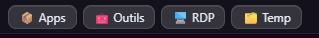
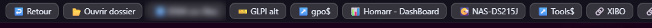

# 🚀 Techbar

**Techbar** est un générateur de configuration pour **Zebar v3**, basé sur l’arborescence de fichiers Windows.

Il permet de transformer un simple dossier (`C:\techbar`) en **launcher visuel dynamique** dans Zebar, sans avoir à éditer manuellement des fichiers JSON.

---

## Screenshots

### Main view



### Example view



---

## 🧠 Concept

Techbar repose sur une architecture simple :

```text
C:\techbar  →  generate_jzone.py  →  jzone.json  →  Zebar v3 (template)
````

* 📁 **Filesystem** → définit la structure
* ⚙️ **Python** → génère la config
* 🎨 **Zebar v3** → affiche le résultat

---

## ⚡ Quick Start

1. Copier le template dans :

   ```text
   C:\Users\<USERNAME>\.glzr\zebar\
   ```

2. Créer :

   ```text
   C:\techbar
   ```

3. Ajouter les fichiers :

   * `generate_jzone.py`
   * `Start_Generate.bat`

4. Installer la dépendance Python :

   ```bash
   pip install pywin32
   ```

5. Lancer :

   ```text
   Start_Generate.bat
   ```

---

## 📦 Installation

### 1. Installer Zebar v3

Assurez-vous d’avoir **Zebar v3** installé.

### 2. Installer le template Techbar

Copiez le dossier `techbar` (template) dans :

```text
C:\Users\<USERNAME>\.glzr\zebar\
```

> ⚠️ Le dossier `.glzr` est caché sous Windows.

### 3. Créer le dossier source

```text
C:\techbar
```

### 4. Ajouter les fichiers

Dans `C:\techbar`, placez :

* `generate_jzone.py`
* `Start_Generate.bat`

### 5. Exemple minimal

```text
C:\techbar
├─ Apps
│  └─ Docker Desktop.lnk
├─ Tools
│  └─ Terminal.lnk
├─ $_Temp
```

---

## 🧩 Prérequis

* Windows
* Python 3 recommandé
* Zebar v3 installé

### Dépendance Python

```bash
pip install pywin32
```

`pywin32` permet de résoudre correctement les raccourcis `.lnk`.

Sans cette dépendance, Techbar fonctionne, mais la détection des cibles `.lnk` peut être limitée.

---

## ▶️ Utilisation

Double-cliquez sur :

```text
Start_Generate.bat
```

Le script :

* génère `jzone.json`
* copie automatiquement le fichier dans Zebar

---

## ⚙️ Configuration

Dans `Start_Generate.bat`, adaptez le chemin :

```bat
set ZEBAR_TARGET=C:\Users\USERNAME\.glzr\zebar\techbar\jzone.json
```

---

## ✨ Fonctionnalités

* Génération automatique de `jzone.json`
* Navigation basée sur les dossiers
* Personnalisation via JSON locaux
* Gestion intelligente des raccourcis `.lnk`
* Support de plusieurs types, apps, scripts, URLs, etc.
* Aucun besoin d’éditer du JSON à la main

---

## 🧠 Fonctionnement

### Règles principales

* dossier normal → `view`
* dossier `$_Nom` → `folder`
* fichiers → actions Zebar

### Extensions supportées

* `.exe` → application
* `.lnk` → analysé automatiquement
* `.url` → URL
* `.rdp` → fichier
* `.ps1` / `.bat` → commande

### Résolution des raccourcis

* `.lnk` → résolution de la cible
* `.url` → lecture de l’URL
* fallback → fichier lui-même

---

## 🎛️ Personnalisation

### `.zebar.json` (dossier)

```json
{
  "label": "Apps",
  "icon": "📦",
  "order": 10
}
```

### `.items.json` (fichiers)

```json
{
  "Docker Desktop.lnk": {
    "label": "Docker",
    "icon": "🐳"
  }
}
```

### `.whattypes.json` (override global)

```json
{
  "Temp": {
    "type": "folder"
  }
}
```

---

## 🔄 Ordre de priorité

1. détection automatique
2. `.zebar.json`
3. `.whattypes.json`
4. type final

---

## 📊 Tri

* `order`
* puis `label`

Par défaut :

```text
order = 9999
```

---

## 🧩 Positionnement

Techbar **n’est pas un fork de Zebar**.

C’est un outil complémentaire qui :

* génère la configuration
* simplifie l’organisation
* automatise la maintenance
